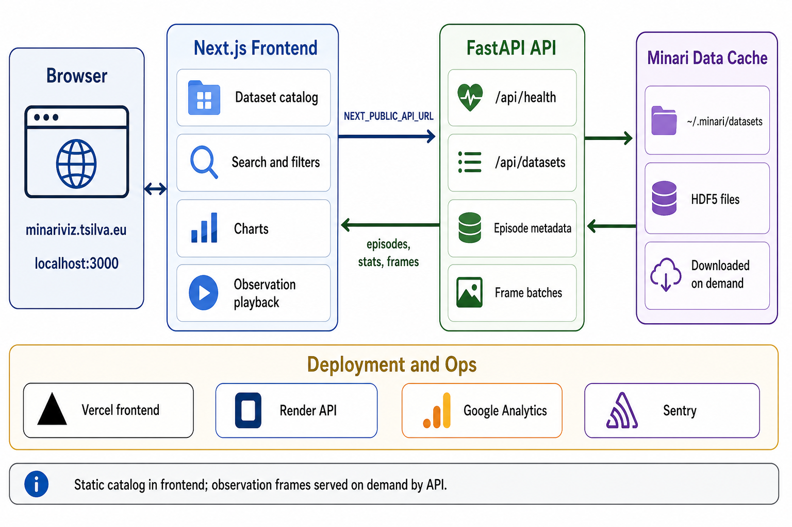

<p align="center">
  
  <br />
  <!-- repo-tagline:start -->
  <strong>🔬 Explore and visualize Minari offline reinforcement learning datasets 📊</strong>
  <!-- repo-tagline:end -->
</p>

[Live Demo](https://minariviz.tsilva.eu/)

minariviz is a browser-based explorer for Minari offline reinforcement learning datasets. It helps researchers and practitioners search the catalog, filter by namespace, compare metadata, and inspect reward and episode statistics without jumping between dataset docs.

The Next.js frontend includes the static dataset catalog and charts. A separate FastAPI service powers the observation viewer by downloading Minari datasets on demand, reading local HDF5 files, and returning batched JPEG frames to the browser.

## Install

```bash
git clone https://github.com/tsilva/minariviz.git
cd minariviz
pnpm install
```

Start the frontend:

```bash
pnpm dev --port auto
```

Open the localhost URL printed by the server.

To use the observation viewer locally, start the API in another shell:

```bash
cd api
python -m venv .venv
source .venv/bin/activate
pip install --require-hashes -r requirements.lock
uvicorn main:app --host 0.0.0.0 --port 8000
```

## Commands

```bash
pnpm dev       # start the Next.js development server
pnpm build     # build the frontend for production
pnpm start     # start the production Next.js server
pnpm lint      # run ESLint
pnpm typecheck # run the standalone TypeScript gate
pnpm test:deps # exercise patched dependency security boundaries
pnpm test:observations # check observation API routing and cold-start handling
```

```bash
cd api
uvicorn main:app --host 0.0.0.0 --port 8000  # start the FastAPI service
```

## Notes

- Use `pnpm` for JavaScript dependencies; the repo enforces it during `preinstall`.
- The API container installs the hash-locked `api/requirements.lock`. Regenerate it with the `uv pip compile` command recorded in the lock header; that command excludes packages published in the preceding seven days.
- Observation requests use the frontend's `/api` proxy, so previews and auto-port development do not require extra CORS origins. `NEXT_PUBLIC_API_URL` configures the proxy destination at build time: the default is `http://localhost:8000` in development and `https://minariviz-api.onrender.com` in production. Production ignores loopback URLs left over from local dotenv settings. Set a hosted HTTP(S) API URL to override the production destination; redeploy after changing it.
- The viewer allows up to a minute for the hosted API to wake up, opens the first episode automatically, and offers a retry if the connection fails. Loading a dataset for the first time may take longer while the API downloads it.
- The API installs Minari's Hugging Face extra to download datasets and stores them under `~/.minari/datasets`. Run `python -m unittest discover -s api` from the repository root to check that the downloader is available.
- The observation viewer requires the Python API server. The static catalog, filtering, and charts run in the frontend.
- Optional analytics and monitoring keys are listed in `.env.example`: `NEXT_PUBLIC_GA_MEASUREMENT_ID`, `NEXT_PUBLIC_SENTRY_DSN`, `SENTRY_DSN`, `SENTRY_ORG`, `SENTRY_PROJECT`, `SENTRY_AUTH_TOKEN`, and `SENTRY_ENVIRONMENT`.
- Vercel builds the Next.js frontend. `render.yaml` defines a Docker-backed Render service for the FastAPI API, with `/api/health` configured as the Render health check path.

## Architecture



## License

[MIT](LICENSE)
